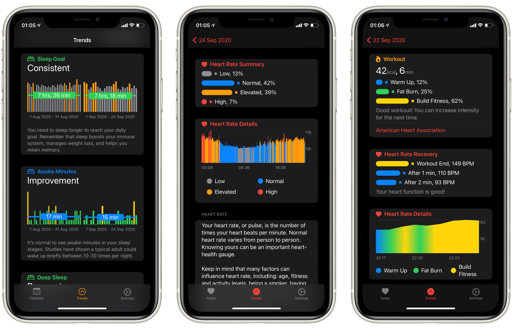

# SwiftUICharts
A simple line and bar charting library that support accessibility written using SwiftUI.


## Usage

You can find all the examples [here](https://github.com/mecid/SwiftUICharts/blob/main/Sources/SwiftUICharts/Previews.swift).

### Vertical bar chart
```swift
let highIntensity = Legend(color: .orange, label: "High Intensity", order: 5)
let buildFitness = Legend(color: .yellow, label: "Build Fitness", order: 4)
let fatBurning = Legend(color: .green, label: "Fat Burning", order: 3)
let warmUp = Legend(color: .blue, label: "Warm Up", order: 2)
let low = Legend(color: .gray, label: "Low", order: 1)

let limit = DataPoint(value: 130, label: "5", legend: fatBurning)

let points: [DataPoint] = [
    .init(value: 70, label: "1", legend: low),
    .init(value: 90, label: "2", legend: warmUp),
    .init(value: 91, label: "3", legend: warmUp),
    .init(value: 92, label: "4", legend: warmUp),
    .init(value: 130, label: "5", legend: fatBurning),
    .init(value: 124, label: "6", legend: fatBurning),
    .init(value: 135, label: "7", legend: fatBurning),
    .init(value: 133, label: "8", legend: fatBurning),
    .init(value: 136, label: "9", legend: fatBurning),
    .init(value: 138, label: "10", legend: fatBurning),
    .init(value: 150, label: "11", legend: buildFitness),
    .init(value: 151, label: "12", legend: buildFitness),
    .init(value: 150, label: "13", legend: buildFitness),
    .init(value: 136, label: "14", legend: fatBurning),
    .init(value: 135, label: "15", legend: fatBurning),
    .init(value: 130, label: "16", legend: fatBurning),
    .init(value: 130, label: "17", legend: fatBurning),
    .init(value: 150, label: "18", legend: buildFitness),
    .init(value: 151, label: "19", legend: buildFitness),
    .init(value: 150, label: "20", legend: buildFitness),
    .init(value: 160, label: "21", legend: highIntensity),
    .init(value: 159, label: "22", legend: highIntensity),
    .init(value: 161, label: "23", legend: highIntensity),
    .init(value: 158, label: "24", legend: highIntensity),
] 

BarChartView(dataPoints: points, limit: limit)
```

### Horizontal bar chart
```swift
let warmUp = Legend(color: .blue, label: "Warm Up", order: 2)
let low = Legend(color: .gray, label: "Low", order: 1)

let points: [DataPoint] = [
    .init(value: 70, label: "1", legend: low),
    .init(value: 90, label: "2", legend: warmUp),
    .init(value: 91, label: "3", legend: warmUp),
    .init(value: 92, label: "4", legend: warmUp)
] 

HorizontalBarChartView(dataPoints: points)
```

### Line chart
```swift
let buildFitness = Legend(color: .yellow, label: "Build Fitness", order: 4)
let fatBurning = Legend(color: .green, label: "Fat Burning", order: 3)
let warmUp = Legend(color: .blue, label: "Warm Up", order: 2)
let low = Legend(color: .gray, label: "Low", order: 1)

let points: [DataPoint] = [
    .init(value: 70, label: "1", legend: low),
    .init(value: 90, label: "2", legend: warmUp),
    .init(value: 91, label: "3", legend: warmUp),
    .init(value: 92, label: "4", legend: warmUp),
    .init(value: 130, label: "5", legend: fatBurning),
    .init(value: 124, label: "6", legend: fatBurning),
    .init(value: 135, label: "7", legend: fatBurning),
    .init(value: 133, label: "8", legend: fatBurning),
    .init(value: 136, label: "9", legend: fatBurning),
    .init(value: 138, label: "10", legend: fatBurning),
    .init(value: 150, label: "11", legend: buildFitness),
    .init(value: 151, label: "12", legend: buildFitness),
    .init(value: 150, label: "13", legend: buildFitness)
]

LineChartView(dataPoints: points)
```

## Installation
Add this Swift package in Xcode using its Github repository url. (File > Swift Packages > Add Package Dependency...)

## Author
Majid Jabrayilov: cmecid@gmail.com

## License
SwiftUICharts is available under the MIT license. See the LICENSE file for more info.
